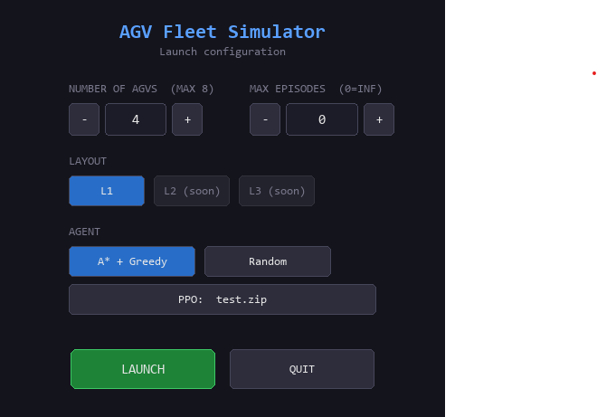
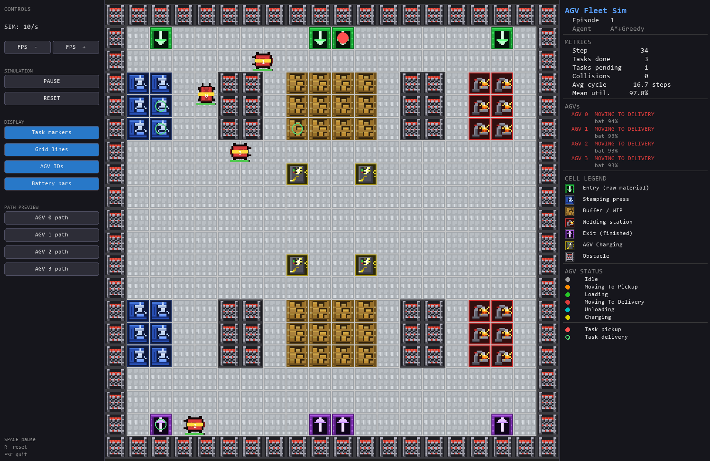

# RL-AGVs Automotive Industry

Systematic evaluation of **PPO (Proximal Policy Optimization)** vs **A\* + Greedy** for AGV fleet management in an automotive stamping and welding components plant.

Master's thesis — Industria 4.0, UNIR.

---

## Overview

A fleet of Automated Guided Vehicles (AGVs) transports materials through the production stages of a simulated automotive plant. Two fleet management strategies are compared:

| Strategy         | Type                   | Description                                                                              |
| ---------------- | ---------------------- | ---------------------------------------------------------------------------------------- |
| **A\* + Greedy** | Classical baseline     | Assigns each idle AGV the nearest pending task (Manhattan distance). Navigation via A\*. |
| **PPO**          | Reinforcement learning | Learned policy trained with Stable-Baselines3 on the Gymnasium environment.              |

---

## Production Flow

```text
ENTRY → STAMPING → BUFFER → WELDING → EXIT
```

| Stage | Pickup | Delivery | Description | Reward |
| ----- | ------ | -------- | ----------- | ------ |
| 0 | Entry | Stamping | Raw sheet metal delivered to press cells | +10 |
| 1 | Stamping | Buffer | Stamped parts moved to WIP storage | +12 |
| 2 | Buffer | Welding | Parts retrieved for welding | +14 |
| 3 | Welding | Exit | Finished components sent to output | +16 |

Tasks are generated stochastically and weighted toward earlier stages (more raw material demand).
Later-stage task completions yield higher reward to reflect production value.

---

## Project Structure

```text
src/
├── env/
│   ├── plant_map.py        # 20x20 grid — ENTRY/STAMPING/BUFFER/WELDING/EXIT/CHARGING layout
│   └── agv_fleet_env.py    # Gymnasium environment — action/observation/reward/metrics
├── navigation/
│   ├── pathfinder.py       # BasePathfinder ABC (Strategy pattern)
│   └── astar.py            # A* pathfinder with Manhattan heuristic
├── agents/
│   ├── base_agent.py       # BaseAgent ABC (Template Method pattern)
│   └── astar_agent.py      # Greedy nearest-task classical baseline
└── rendering/
    └── pygame_renderer.py  # Real-time 2D Pygame visualizer with sprites and metrics panel
```

---

## Plant Map

20×20 grid with dedicated zones for each production stage:

| Symbol | Cell type | Description |
| ------ | --------- | ----------- |
| `I` | ENTRY | Raw material input |
| `S` | STAMPING | Stamping press cells |
| `B` | BUFFER | WIP intermediate storage |
| `W` | WELDING | Welding station cells |
| `O` | EXIT | Finished component output |
| `C` | CHARGING | AGV charging stations |
| `#` | OBSTACLE | Walls and fixed machinery |
| `.` | FREE | AGV circulation corridors |

---

## Environment

**Observation space:** `Box(0.0, 1.0, shape=(68,), float32)`
Flat normalized vector: 5 features × 4 AGVs + 6 features × 8 task slots.

**Action space:** `MultiDiscrete([9, 9, 9, 9])`
Per AGV: `0` = wait, `1–8` = assign task at that index.

**Reward:**

| Event | Value |
| ----- | ----- |
| Task completed stage 0 | +10 |
| Task completed stage 1 | +12 |
| Task completed stage 2 | +14 |
| Task completed stage 3 | +16 |
| Per timestep | −0.01 |
| Collision | −5 |
| Invalid action | −0.5 |

**Key metrics** (available in `info` dict after each `step()`):

| Metric | Key |
| ------ | --- |
| Tasks completed | `tasks_completed` |
| Tasks completed per stage | `tasks_by_stage` |
| Average cycle time | `avg_cycle_time` |
| AGV utilization per vehicle | `agv_utilization` |
| Mean fleet utilization | `mean_utilization` |
| Collisions | `collisions` |

---

## Installation

```bash
pip install -r requirements.txt
```

Requirements: `gymnasium>=0.29`, `stable-baselines3>=2.3`, `numpy>=1.26`, `pygame>=2.5`

---

## Running the smoke test

Verifies that the environment, pathfinder and baseline agent initialize and run correctly:

```bash
python smoke_test.py
```

Expected output summary:

```text
[1/5] PlantMap          — grid layout printed, cell counts and flow verified
[2/5] Environment       — action/observation spaces printed
[3/5] reset()           — observation shape and initial tasks verified
[4/5] Random agent      — 50-step episode with random actions
[5/5] AStarAgent        — 50-step episode with greedy baseline
Smoke test PASSED
```

---

## Visual demo (Pygame)

```bash
python run_visual.py
```

### Launch menu



Before the simulation starts, a configuration screen is shown:

| Field | Description |
| ----- | ----------- |
| **NUMBER OF AGVS** | Fleet size, from 1 to 8. Adjusted with `−` / `+`. |
| **MAX EPISODES** | Number of episodes to run before stopping. `0` runs indefinitely. |
| **LAYOUT** | Plant map layout. L1 is the default automotive plant. L2 and L3 are planned variants. |
| **AGENT** | `A* + Greedy` — classical baseline; `Random` — random actions; `PPO` — load a trained model by entering its `.zip` path. |
| **LAUNCH** | Starts the simulation with the selected settings. |
| **QUIT** | Exits the application. |

### Simulation window



The window has three areas: a left control panel, the plant grid in the center, and a right metrics panel.

#### Left panel — controls

| Section | Element | Description |
| ------- | ------- | ----------- |
| **Header** | `SIM: N/s` | Current simulation speed in steps per second. |
| | `FPS −` / `FPS +` | Decrease or increase simulation speed. Hold the button for continuous repeat. |
| **Simulation** | `PAUSE` | Freeze / resume the simulation. Dims the grid while paused. |
| | `RESET` | End the current episode and start a new one. |
| **Display** | `Task markers` | Show/hide pickup and delivery markers on the grid. |
| | `Grid lines` | Show/hide the cell grid overlay. |
| | `AGV IDs` | Show/hide the ID number rendered on each AGV. |
| | `Battery bars` | Show/hide the battery indicator below each AGV. |
| **Path preview** | `AGV N path` | Toggle the planned path overlay for each individual AGV. Clicking an AGV on the grid also toggles its path. |
| **Footer** | Keyboard hints | Quick reference for `SPACE`, `R`, `ESC`. |

#### Center — plant grid (20×20)

Each cell is rendered with a sprite matching its type. AGVs are drawn as tinted forklift icons on top of the grid; the tint color reflects their current status. The panels on the left and right can be resized by dragging their dividers.

**Task markers:**

| Marker | Meaning |
| ------ | ------- |
| Red filled dot | Pickup location of a pending or assigned task |
| Green ring | Delivery location of a task currently in progress |

**Path preview** (when enabled): a semi-transparent colored line traces the AGV's planned route, with dots at each waypoint fading toward the destination and a ring marking the final cell.

**Particle effects:** a burst of colored sparks is emitted each time an AGV completes a pickup or delivery. The color varies by production stage.

#### Right panel — metrics and status

| Section | Content |
| ------- | ------- |
| **Header** | Episode number and active agent label. |
| **METRICS** | Step count, tasks completed, tasks pending, collisions, average cycle time (steps), mean fleet utilization (%). |
| **AGVs** | Per-AGV row showing current status (color-coded) and battery level. |
| **CELL LEGEND** | Sprite reference for every cell type in the plant. |
| **AGV STATUS** | Color legend for each operating state. |
| **Task markers** | Reminder of the pickup (red dot) and delivery (green ring) marker shapes. |

**AGV status colors:**

| Color | State |
| ----- | ----- |
| `#A0A0A0` | Idle |
| `#FF8C00` | Moving to pickup |
| `#28C828` | Loading |
| `#DC3C3C` | Moving to delivery |
| `#00BEBE` | Unloading |
| `#DCD200` | Charging |

#### Keyboard shortcuts

| Key | Action |
| --- | ------ |
| `SPACE` | Pause / resume |
| `↑` / `↓` | Increase / decrease simulation speed |
| `R` | Reset episode |
| `ESC` / `Q` | Quit |

---

## Using the environment

```python
from src.env import AGVFleetEnv
from src.agents import AStarAgent

env = AGVFleetEnv(n_agvs=4, n_tasks_max=8, max_steps=500, seed=42)
agent = AStarAgent()

obs, info = env.reset()
agent.reset()

for _ in range(500):
    action = agent.select_action(env)
    obs, reward, terminated, truncated, info = env.step(action)
    if terminated or truncated:
        break

print(info)
env.close()
```

---

## Tech stack

- **RL training:** Python · Gymnasium · Stable-Baselines3 (PPO)
- **2D visualization:** Pygame (real-time renderer with sprites)
- **3D visualization:** CoppeliaSim + ZeroMQ bridge *(planned)*
- **Monitoring:** Grafana *(planned)*
- **Platform:** Windows 10
