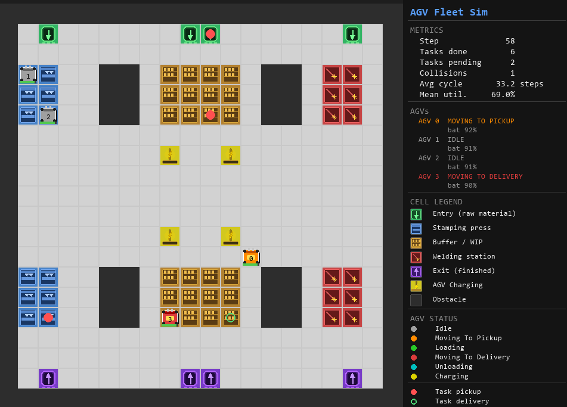

# RL-AGVs Automotive Industry

Systematic evaluation of **PPO (Proximal Policy Optimization)** vs **A\* + Greedy** for AGV fleet management in an automotive stamping and welding components plant.

Master's thesis — Industria 4.0, UNIR.

---

## Overview

A fleet of Automated Guided Vehicles (AGVs) transports materials through the production stages of a simulated automotive plant. Two fleet management strategies are compared:

| Strategy         | Type                   | Description                                                                              |
| ---------------- | ---------------------- | ---------------------------------------------------------------------------------------- |
| **A\* + Greedy** | Classical baseline     | Assigns each idle AGV the nearest pending task (Manhattan distance). Navigation via A\*. |
| **PPO**          | Reinforcement learning | Learned policy trained with Stable-Baselines3 on the Gymnasium environment.              |

---

## Production Flow

```
ENTRY → STAMPING → BUFFER → WELDING → EXIT
```

| Stage | Pickup     | Delivery | Description                              |
| ----- | ---------- | -------- | ---------------------------------------- |
| 0     | Entry      | Stamping | Raw sheet metal delivered to press cells |
| 1     | Stamping   | Buffer   | Stamped parts moved to WIP storage       |
| 2     | Buffer     | Welding  | Parts retrieved for welding              |
| 3     | Welding    | Exit     | Finished components sent to output       |

Tasks are generated stochastically and weighted toward earlier stages (more raw material demand).
Later-stage task completions yield higher reward to reflect production value.

---

## Project Structure

```
src/
├── env/
│   ├── plant_map.py        # 20x20 grid — ENTRY/STAMPING/BUFFER/WELDING/EXIT/CHARGING layout
│   └── agv_fleet_env.py    # Gymnasium environment — action/observation/reward/metrics
├── navigation/
│   ├── pathfinder.py       # BasePathfinder ABC (Strategy pattern)
│   └── astar.py            # A* pathfinder with Manhattan heuristic
├── agents/
│   ├── base_agent.py       # BaseAgent ABC (Template Method pattern)
│   └── astar_agent.py      # Greedy nearest-task classical baseline
└── rendering/
    └── pygame_renderer.py  # Real-time 2D Pygame visualizer with sprites and metrics panel
```

---

## Plant Map

20×20 grid with dedicated zones for each production stage:

| Symbol | Cell type | Description                |
| ------ | --------- | -------------------------- |
| `I`    | ENTRY     | Raw material input         |
| `S`    | STAMPING  | Stamping press cells       |
| `B`    | BUFFER    | WIP intermediate storage   |
| `W`    | WELDING   | Welding station cells      |
| `O`    | EXIT      | Finished component output  |
| `C`    | CHARGING  | AGV charging stations      |
| `#`    | OBSTACLE  | Walls and fixed machinery  |
| `.`    | FREE      | AGV circulation corridors  |

---

## Environment

**Observation space:** `Box(0.0, 1.0, shape=(68,), float32)`
Flat normalized vector: 5 features × 4 AGVs + 6 features × 8 task slots.

**Action space:** `MultiDiscrete([9, 9, 9, 9])`
Per AGV: `0` = wait, `1–8` = assign task at that index.

**Reward:**

- `+10 + stage×2` per completed task (later stages yield more)
- `−0.01` per timestep
- `−5` per collision
- `−0.5` per invalid action

**Key metrics** (available in `info` dict after each `step()`):

| Metric                      | Key                  |
| --------------------------- | -------------------- |
| Tasks completed             | `tasks_completed`    |
| Tasks completed per stage   | `tasks_by_stage`     |
| Average cycle time          | `avg_cycle_time`     |
| AGV utilization per vehicle | `agv_utilization`    |
| Mean fleet utilization      | `mean_utilization`   |
| Collisions                  | `collisions`         |

---

## Installation

```bash
pip install -r requirements.txt
```

Requirements: `gymnasium>=0.29`, `stable-baselines3>=2.3`, `numpy>=1.26`, `pygame>=2.5`

---

## Running the smoke test

Verifies that the environment, pathfinder and baseline agent initialize and run correctly:

```bash
python smoke_test.py
```

Expected output summary:

```
[1/5] PlantMap          — grid layout printed, cell counts and flow verified
[2/5] Environment       — action/observation spaces printed
[3/5] reset()           — observation shape and initial tasks verified
[4/5] Random agent      — 50-step episode with random actions
[5/5] AStarAgent        — 50-step episode with greedy baseline
Smoke test PASSED
```

---

## Visual demo (Pygame)



Runs the environment in real time with a 2D grid renderer. The window is split into two panels:

**Left — plant grid (20×20)**

Each cell is rendered with a sprite indicating its type. AGVs are drawn as forklift icons on top of the grid. Two markers appear on the floor to indicate active task targets:

| Marker | Meaning           |
| ------ | ----------------- |
| Red dot    | Task pickup location  |
| Green dot  | Task delivery location |

**Right — metrics and status panel**

| Section      | Content                                                                 |
| ------------ | ----------------------------------------------------------------------- |
| **METRICS**  | Episode step count, tasks completed/pending, collisions, average cycle time, mean fleet utilization |
| **AGVs**     | Per-AGV status (color-coded) and battery level                          |
| **CELL LEGEND** | Sprite reference for every cell type in the plant                    |
| **AGV STATUS**  | Color legend for each AGV operating state                            |

AGV status colors:

| Color  | State               |
| ------ | ------------------- |
| Grey   | Idle                |
| Orange | Moving to pickup    |
| Green  | Loading             |
| Red    | Moving to delivery  |
| Cyan   | Unloading           |
| Yellow | Charging            |

```bash
python run_visual.py                             # AStarAgent at 10 fps (default)
python run_visual.py --agent random              # random actions
python run_visual.py --agent ppo --model <path>  # trained PPO model
python run_visual.py --fps 20                    # faster simulation
python run_visual.py --n_agvs 4                  # number of AGVs
python run_visual.py --episodes 5                # stop after 5 episodes
```

Window controls:

| Key           | Action                     |
| ------------- | -------------------------- |
| `SPACE`       | Pause / resume             |
| `UP` / `DOWN` | Increase / decrease speed  |
| `R`           | Reset episode              |
| `ESC` / `Q`   | Quit                       |

---

## Using the environment

```python
from src.env import AGVFleetEnv
from src.agents import AStarAgent

env = AGVFleetEnv(n_agvs=4, n_tasks_max=8, max_steps=500, seed=42)
agent = AStarAgent()

obs, info = env.reset()
agent.reset()

for _ in range(500):
    action = agent.select_action(env)
    obs, reward, terminated, truncated, info = env.step(action)
    if terminated or truncated:
        break

print(info)
env.close()
```

---

## Tech stack

- **RL training:** Python · Gymnasium · Stable-Baselines3 (PPO)
- **2D visualization:** Pygame (real-time renderer with sprites)
- **3D visualization:** CoppeliaSim + ZeroMQ bridge *(planned)*
- **Monitoring:** Grafana *(planned)*
- **Platform:** Windows 10
